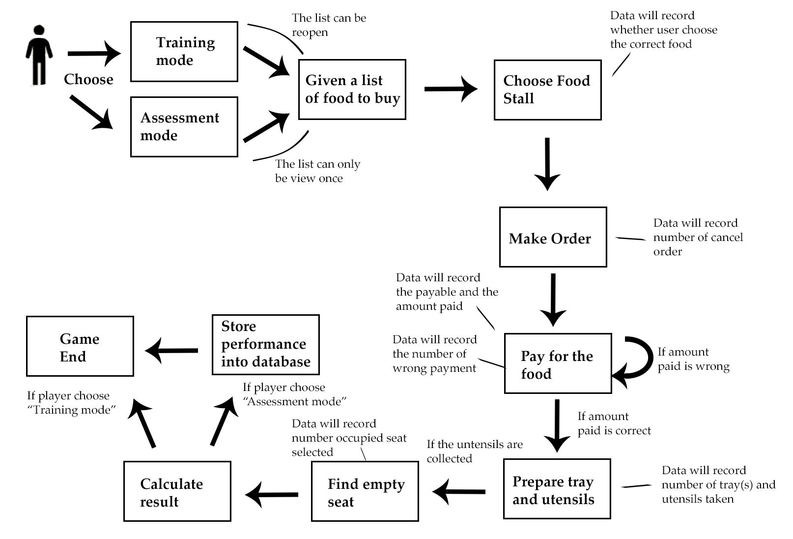

# FYP

This is a NTU FYP project done by Aldo Chu Yu Zheng

A unity 3d game using version 2019.2.2f1

The hardware require to play this project: Oculus Quest

<h1>Activities for Daily Living Virtual Reality Game</h1>

<h2>Background:</h2>

Cognitive impairment is a phenomenon when a person's cognitive ability has declined and they have difficulty remembering, thinking, focusing or making choices that affect their daily lives. The causes of cognitive impairment are not limited to Alzheimer’s disease, conditions such as stroke, traumatic brain injury, side effects of medication, vitamin deficiency, and depression can also cause cognitive impairment. Cognitive impairment can range from mild, or severe, or in-between. With mild cognitive impairment (MCI), people will still be able to continue their daily activities. However, for severe cases, they may partially lose the ability to do so, resulting in the inability to live independently. 

Older adults have a higher chance of getting MCI. Based on the statistics provided by the Alzheimer's Association, approximately 15 to 20 percent of people aged 65 or older have MCI. The statistic is also supported by a report from the Centers for Disease Control that age is the greatest risk factor for cognitive impairment where the elderly have a higher chance of getting MCI. With an increase in ageing population, the growth of the elderly with MCI will also increase proportionally. However, with the declining old-age support ratio, it would be difficult for an elderly who suffers from MCI to find someone to rely on. This highlights the need for an effective healthcare treatment that can improve MCI patients’ conditions where they can live independently. 

MCI that is caused by the side effects of medication, vitamin deficiency, and depression may be treatable, but for other cases, there is currently no cure. Although there is no medical cure for untreatable cognitive impairment, research has shown that cognitive training can delay or prevent further cognitive decline and, in some cases, improve patients’ cognition and benefits them.

Recent researches have attempted to use new technologies and other methodologies to replace the traditional training of daily activities. Instead of teaching strategies that help remember tasks for daily activities, other researches used the method of repetition training harnessing Virtual Reality (VR) technology to set up a controlled environment where they can monitor and adjust the complexity of the training content. Results suggest that using VR technology may be a good addition to the rehabilitation program. However, there is currently no VR rehabilitation product for MCI in Singapore.

<h2>Scope:</h2>

This project is designed and developed into a VR game that can be used for cognitive rehabilitation training. Training content is devised to meet the requirements suggested by occupational therapists from the Institute of Mental Health (IMH). The game would be set in a hawker centre environment where the patient is required to follow a sequence of tasks shown in figure 1 from purchasing a list of foods to finding an empty seat which is localized for Singaporean. There are two different modes in the game (a) training mode, where in-game assist function will be available for the users to view the list of foods to buy; and (b) assessment mode, where in-game assist function will not be available to the user. 

At the end of each session, user performance on each task will be recorded, and assessed by an occupational therapist. The information gathered from the game application may help the occupational therapist to have a better understanding of the status of their patients, thus tailoring more effective training. 

<i>Figure 1</i>

<h3>P.S:</h3>

This project can't be publish or used personally by non-staff of Nanyang Technological University without the approval of Nanyang Technological University. The content of the project uses materials related to Monetary Authority of Singapore which required permission from the authority. Using this project without the proper permission may infringe the law and constitute as a crime.   
